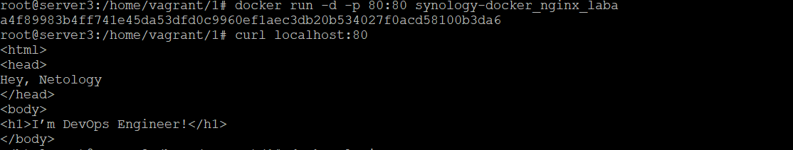
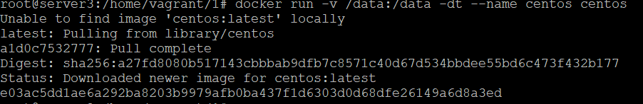
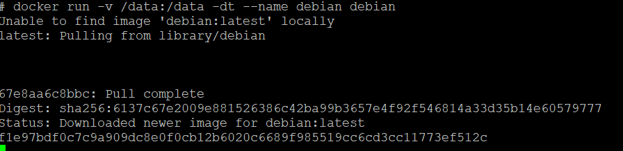
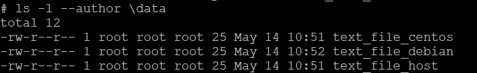
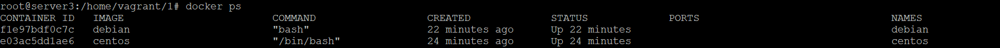

# Домашнее задание к занятию "5.3. Введение. Экосистема. Архитектура. Жизненный цикл Docker контейнера"

## Задача 1

Сценарий выполения задачи:

- создайте свой репозиторий на https://hub.docker.com;
- выберете любой образ, который содержит веб-сервер Nginx;
>nginx:alpine
- создайте свой fork образа;
```
docker build -t synology-docker_nginx_laba .

Dockerfile
FROM nginx:alpine
COPY 1 /usr/share/nginx/html
```
- реализуйте функциональность:
запуск веб-сервера в фоне с индекс-страницей, содержащей HTML-код ниже:
```
<html>
<head>
Hey, Netology
</head>
<body>
<h1>I’m DevOps Engineer!</h1>
</body>
</html>
```


Опубликуйте созданный форк в своем репозитории и предоставьте ответ в виде ссылки на https://hub.docker.com/username_repo.
docker push ahbrd2/synology-docker_nginx_laba:v1

https://hub.docker.com/r/ahbrd2/synology-docker_nginx_laba


## Задача 2

Посмотрите на сценарий ниже и ответьте на вопрос:
"Подходит ли в этом сценарии использование Docker контейнеров или лучше подойдет виртуальная машина, физическая машина? Может быть возможны разные варианты?"

Детально опишите и обоснуйте свой выбор.

--

Сценарий:

- Высоконагруженное монолитное java веб-приложение; >Не подходит, состоит из нескольих процессов требуется проработка связей, недосток быстродействия. Лучше подойдет физическая машина для макс быстродействия. 
- Nodejs веб-приложение;>Подойдет Docker. Подходит.Простота развертывания приложения, лёгковесность и масштабирование.
- Мобильное приложение c версиями для Android и iOS; >Не походит, docker не является здесь целевым решением. Предположительно использование виртуальных машин.
- Шина данных на базе Apache Kafka; Не походит.Лучше использовать физические и виртуальные сервера - в основном связано с тем что при переконфигурировании шины велика вероятность потери отправленных данных.
- Elasticsearch кластер для реализации логирования продуктивного веб-приложения - три ноды elasticsearch, два logstash и две ноды kibana; Не подходит. При организации логгирования с использованием elk-стека есть несколько вопросов ответы на который позволяют определить что будет использовано: 1. Объём логов 2. Период хранения 3. скорость поиска - в случае высоконагруженных систем с большими объёмами и сроками хранения логов целесообразно использовать физические/виртуальные сервера, т.к. стек elk обычно хорошо утилизирует сервера.
- Мониторинг-стек на базе Prometheus и Grafana; Подходит. Преймущества масштабируемость, лёгкость и скорость развёртывания.
- MongoDB, как основное хранилище данных для java-приложения;Не подходит, лучше использовать физическим или виртуальным серверам, ввиду сложности администрирования MongoDB внутри контейнера и вероятности потери данных при потере контейнера.
- Gitlab сервер для реализации CI/CD процессов и приватный (закрытый) Docker Registry.Docker не подходит в данном случае, т.к. при потере контейнера будет сложно восстановить частоизменяемые данные. Здесь больше подходят физические или виртуальные сервера.

При выборе могут быть дополнительные условия которые могут поменять используемое решение, завист от поставленной ТЗ.
## Задача 3

- Запустите первый контейнер из образа ***centos*** c любым тэгом в фоновом режиме, подключив папку ```/data``` из текущей рабочей директории на хостовой машине в ```/data``` контейнера;
docker run -v /data:/data -dt --name centos centos

- Запустите второй контейнер из образа ***debian*** в фоновом режиме, подключив папку ```/data``` из текущей рабочей директории на хостовой машине в ```/data``` контейнера;
docker run -v /data:/data -dt --name debian debian


- Подключитесь к первому контейнеру с помощью ```docker exec``` и создайте текстовый файл любого содержания в ```/data```;
docker exec -it centos /bin/sh  
sh-4.4# echo 'laba synology 3 Zametaev' >/data/text_file_centos  
- Добавьте еще один файл в папку ```/data``` на хостовой машине;
root@server3:/home/vagrant/1# echo 'laba synology 3 Zametaev' >/data/text_file_host  
- Подключитесь во второй контейнер и отобразите листинг и содержание файлов в ```/data``` контейнера.
root@server3:/home/vagrant/1# docker exec -it debian /bin/sh  
 echo 'laba synology 3 Zametaev' >/data/text_file_debian 
   

```

## Задача 4 (*)
